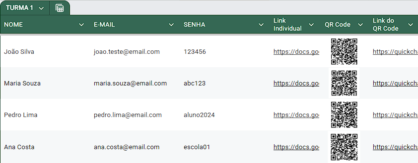
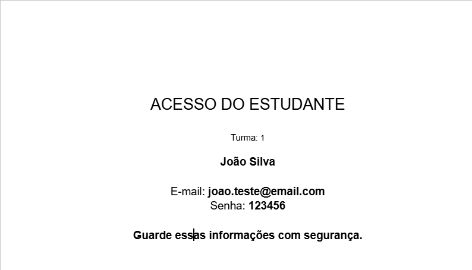
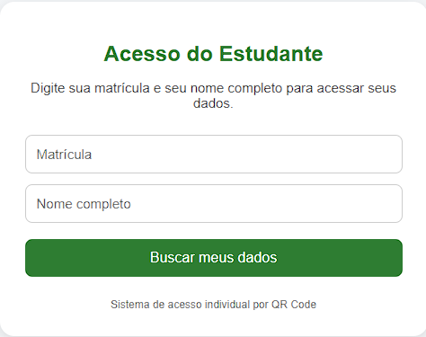

# 🎓 Sistema de Acesso de Alunos via QR Code

Automação com Google Apps Script para gerar e gerenciar acessos individuais de alunos por meio de QR Codes e Web App, garantindo privacidade, organização e escalabilidade no ambiente escolar.

---

## 🔗 Demonstração

Acesse o sistema:  
https://bit.ly/acessoemailalunos

Para teste:

- Matrícula: 12345678  
- Nome: Aluno Teste  

⚠️ Observação:  
Os demais dados do sistema são protegidos e exigem informações válidas.

---

## 📌 Problema

Em ambiente escolar, é comum a necessidade de compartilhar e-mails e senhas dos alunos.  
Fazer isso manualmente pode:

- expor dados de toda a turma  
- gerar desorganização  
- demandar tempo operacional elevado  

---

## ✅ Solução

Este projeto automatiza todo o processo:

- Criação de documentos individuais por aluno  
- Geração de links exclusivos de acesso  
- QR Codes individuais  
- Web App com QR Code único para consulta  
- Atualização dinâmica sem alterar os acessos  

---

## 🏫 Aplicação prática

Sistema desenvolvido e aplicado em contexto escolar real para distribuição de acessos institucionais (@estudante).

Resultados:

- maior organização  
- redução de trabalho manual  
- melhoria na privacidade dos dados  

---

## ⚙️ Tecnologias utilizadas

- Google Sheets  
- Google Apps Script (JavaScript)  
- Google Drive  
- HTML + JavaScript (Web App)  
- QuickChart (QR Code)

---

## 🧠 Como funciona

### 🔹 QR Code individual

- Cada aluno possui um documento próprio  
- O QR Code leva diretamente ao documento  
- Acesso imediato e individual  

---

### 🔹 QR Code único (Web App)

- Um único QR Code para todos os alunos  
- O aluno informa:
  - matrícula  
  - nome completo  
- O sistema valida e retorna o documento correspondente  

---

## 📊 Estrutura da planilha

| ALUNOS | EMAIL | SENHA | Link Individual | QR Code | Link do QR Code | Matrícula |
|--------|-------|-------|-----------------|---------|-----------------|-----------|

---

## 🔁 Atualizações inteligentes

- Novos alunos são reconhecidos automaticamente  
- Links permanecem estáveis  
- QR Codes não precisam ser regenerados  
- Atualizações ocorrem apenas quando necessário  

---

## 🔐 Segurança

- Links individuais e controlados  
- Validação por matrícula + nome completo  
- Normalização de dados (acentos e maiúsculas/minúsculas)  
- Acesso somente leitura  

---

## 🧩 Estrutura do sistema

O projeto é composto por:

- geração de documentos e QR Codes  
- leitura dinâmica da planilha  
- validação de usuários  
- Web App para consulta  
- organização automática no Google Drive  

---

## 📸 Exemplos

### Planilha com QR Codes

---

### Documento individual

---

### Web App de acesso

---

## 📱 Uso prático

O sistema pode ser utilizado por meio de:

- carteirinhas com QR Code  
- murais escolares  
- compartilhamento de link  
- consulta sob demanda  

---

## 🚀 Como usar

1. Criar planilha com a estrutura definida  
2. Inserir dados dos alunos  
3. Executar a função `criarLinksTodasTurmas`  
4. Publicar o Web App  
5. Gerar QR Code do link do sistema  

---

## ⚠️ Limitações

- Dependência da consistência dos dados na planilha  
- Validação baseada em matrícula e nome completo  
- Não possui autenticação avançada (login/senha individual no sistema)

---

## 💡 Origem do projeto

Este projeto surgiu da necessidade de organizar a distribuição de credenciais de alunos de forma segura e eficiente no ambiente escolar.

A solução evoluiu de um processo manual para um sistema automatizado com múltiplas formas de acesso.

---

## 👩‍🏫 Contexto

Projeto aplicado em escola pública, com foco em:

- eficiência operacional  
- organização  
- privacidade  

---

## 📄 Licença

Este projeto está sob a licença MIT.
