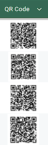

# 🎓 Sistema de Acesso de Alunos via QR Code

Automação com Google Apps Script para gerar acessos individuais de alunos por meio de QR Codes, garantindo privacidade, organização e escalabilidade.

---

## 📌 Problema

Em ambiente escolar, é comum a necessidade de compartilhar e-mails e senhas dos alunos.  
Fazer isso de forma manual pode:

- expor dados de toda a turma  
- gerar desorganização  
- demandar muito tempo  

---

## ✅ Solução

Este projeto automatiza o processo:

- Cria um documento individual para cada aluno  
- Gera um link exclusivo de acesso  
- Cria um QR Code para facilitar o acesso  
- Mantém os dados atualizados sem alterar o QR Code  

---

## 🏫 Aplicação prática

Este sistema foi desenvolvido e aplicado em contexto escolar real para distribuição de acessos individuais de alunos.

A solução permitiu:

- maior organização no processo  
- redução de tempo operacional  
- proteção dos dados dos estudantes  

---

## ⚙️ Tecnologias utilizadas

- Google Sheets  
- Google Apps Script (JavaScript)  
- Google Drive  
- QuickChart (geração de QR Code)  

---

## 🧠 Como funciona

1. A planilha contém:
   - Nome  
   - E-mail  
   - Senha  

2. O script:
   - Cria um documento individual no Google Docs  
   - Gera um link único para cada aluno  
   - Cria um QR Code com esse link  
   - Organiza os arquivos em pastas por turma  
   - Atualiza o documento apenas se a senha mudar  

---

## 📊 Estrutura da planilha

| Nome | E-mail | Senha | Link | QR Code | URL do QR Code |
|------|--------|------|------|--------|----------------|

---

## 🔁 Atualizações inteligentes

- O QR Code não muda  
- O link permanece o mesmo  
- O documento é atualizado apenas quando necessário  

---

## 📱 Uso

1. Gere os QR Codes pela planilha  
2. Imprima e distribua aos alunos  
3. O aluno escaneia o QR Code  
4. Acessa seu documento com e-mail e senha  

---

## 🔐 Considerações de segurança

- Os links são individuais  
- O acesso é somente leitura  
- Recomenda-se não compartilhar QR Codes entre alunos  
- Os dados exibidos neste repositório são fictícios  

---

## 🧩 Estrutura do código

O script é dividido em etapas principais:

- leitura dos dados da planilha  
- verificação de links existentes  
- criação ou atualização de documentos  
- geração de QR Codes  
- organização automática no Google Drive  

---

## 💡 Como esse projeto surgiu

Este projeto nasceu de uma necessidade real em ambiente escolar:  
disponibilizar e-mails e senhas dos alunos de forma individual, sem expor os dados da turma.

Inicialmente, o processo era manual e pouco seguro.

A solução evoluiu para uma automação com Google Apps Script que gera documentos individuais e QR Codes de acesso, garantindo organização, escalabilidade e privacidade.

---

## 🚀 Como usar

1. Abra o Google Sheets  
2. Vá em **Extensões → Apps Script**  
3. Cole o código do projeto  
4. Execute a função principal  
5. Autorize as permissões solicitadas  

---

## 📸 Exemplos

Exemplo da planilha com geração automática de links e QR Codes:

Exemplo de QR Code gerado para acesso individual:

Exemplo do documento acessado pelo aluno:

---

## 👩‍🏫 Contexto

Projeto desenvolvido para uso real em ambiente escolar, com foco em:

- organização  
- eficiência  
- privacidade dos dados  

---

## 📄 Licença

Este projeto está sob a licença MIT.
